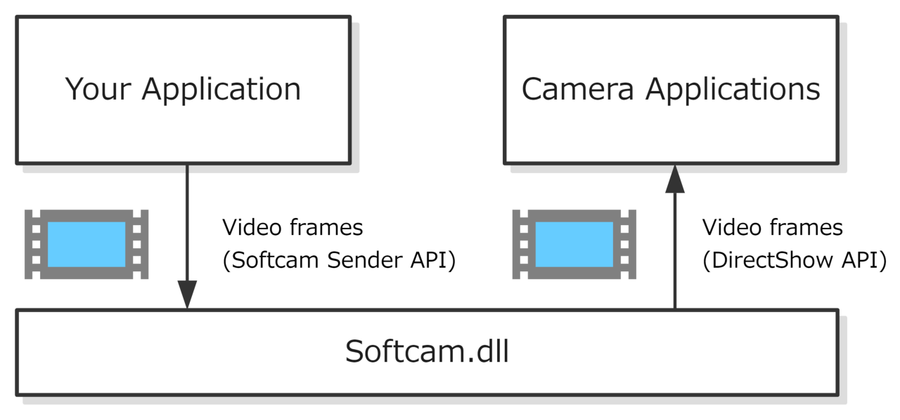

# Softcam

[](https://github.com/tshino/softcam/actions/workflows/msbuild.yml)
[](https://github.com/tshino/softcam/actions/workflows/codeql-analysis.yml)

This is a library to make a virtual webcam on Windows.


## How it works

This software is a DLL which implements a DirectShow filter of Video Input Device category.
Once it is installed to the system, any camera application which is using DirectShow API will recognize the filter as a camera-like device attached to the system.
And thankfully many of camera applications running on Windows use DirectShow API to access camera devices.

This DLL provides Softcam Sender API too. Using this API, your application can create a virtual webcam instance and send arbitrary images as a video stream to the camera application.

Your code will look like this:

```
scCamera cam = scCreateCamera(320, 240, 60);
for (;;)
{
    uint8_t image[320 * 240 * 3];
    DrawSomething(image);
    scSendFrame(cam, image);
}
```
.



## How to build the library

Following software is required.

- Visual Studio 2022 (installed with Desktop development with C++ and Windows 10 SDK)

Open `softcam.sln`, choose the configuration `Release` and the platform `x64`, and build the solution.

If it successfully builds, you will get the DLL `softcam.dll` in the `dist/bin/x64` directory.
The header and the import libraries will also be put into the `dist` directory.

Note: The DLL `softcam.dll` built above is a 64-bit DLL file. In order to support 32-bit camera applications as well, you should build 32-bit `softcam.dll` too by choosing the platform `Win32`. The 32-bit DLL file will be put in the `dist/bin/Win32` directory.

Note: You can use Visual Studio 2019 instead. The project files to use with Visual Studio 2019 have a name with the common suffix `_vs2019`. So your starting point is `softcam_vs2019.sln`.

## Demo

There are two essential example programs in the `examples` directory.
One is a demo (named `sender`) for simple usage of this library.
The other is a program (named `softcam_installer`) for installation/uninstallation of this library to user's systems.

Before running the demo you need to install the library to your system so that camera applications can detect it. So you need to build and run both of the two examples. The steps are as follows.

1. Open `examples/softcam_installer/softcam_installer.sln`, choose configuration `Release` and the platform `x64`, and build the solution.
    - You will get `softcam_installer.exe` in `examples/softcam_installer/x64/Release` directory.
2. Then you register the DLL `softcam.dll` to your system by double-clicking the `RegisterSoftcam.bat` which is in the `examples/softcam_installer` directory.
    - This batch file simply launches `softcam_installer.exe` with the path of the DLL as a command line option.
    - This step, in other words installing this software, does not actually copy any files, instead, it writes the absolute path of the DLL on the registry using appropriate API.
    - Note since this process requires administrator permissions, `softcam_installer.exe` will request the permissions to the user through UAC.
    - Note: Again, in order to support 32-bit camera applications as well, you should build the 32-bit version of `softcam_installer.exe` too by choosing the platform `Win32` in above step 1. And then run `RegisterSoftcam32.bat` as well to register the 32-bit DLL.
    - You can also unregister the DLL using `UnregisterSoftcam.bat` (and `UnregisterSoftcam32.bat` for 32-bit) in the same manner.
3. Open `examples/sender/sender.sln`, choose configuration `Release` and platform `x64` (or `Win32` for 32-bit), and build the solution.
    - Then you get `sender.exe` in `examples/sender/x64/Release` (or `examples/sender/Win32/Release`) directory.
4. Run `sender.exe`.
    - If it runs successfully, you will see a message '`Ok, Softcam is now active.`' in the console. Now you've got a new virtual webcam running on your system.

To see the video stream which is being produced by the `sender.exe`, you can use any camera application. If you don't have a preference at this moment, I recommend you to try my web application `Compare` ([https://tshino.github.io/compare/compare.html](https://tshino.github.io/compare/compare.html)). This is an image comparison tool written in JavaScript, and it has the capability of taking a capture from a webcam. Open the above link, find the camera icon appears on the sidebar, and click it. If it shows a different camera image or fails to connect to the camera, you may need to look at the settings of your browser. In most browsers, a camera icon appears on the address bar, which is a shortcut to the camera settings. Make sure to let the browser use the virtual camera named '`DirectShow Softcam`'. If it doesn't appear in the list of available cameras, try to reboot the browser (or Windows).

Note: To support both 32-bit and 64-bit camera applications, each of the DLL `softcam.dll` of both modes must be built and installed. Once both DLLs are installed in a system, no matter which one your application links to or which one the camera application accesses to, they can communicate and the images are streamed between them correctly.


## Examples

Following examples are available:

- [sender](examples/sender/)
    - This is the demo app explained above. You should look at this one first.
- [softcam_installer](examples/softcam_installer/)
    - Installer/uninstaller implementation of this library.
- [python_binding](examples/python_binding/)
    - Python binding of this library.


## License

[MIT](LICENSE).

Note that the Base Classes library (in [src/baseclasses](src/baseclasses) directory) is a part of [Microsft Windows Samples](https://github.com/microsoft/Windows-classic-samples) (Base Classes is in [Samples/Win7Samples/multimedia/directshow/baseclasses](https://github.com/microsoft/Windows-classic-samples/tree/master/Samples/Win7Samples/multimedia/directshow/baseclasses) directory) which is also provided under MIT license.
